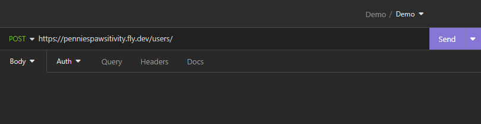
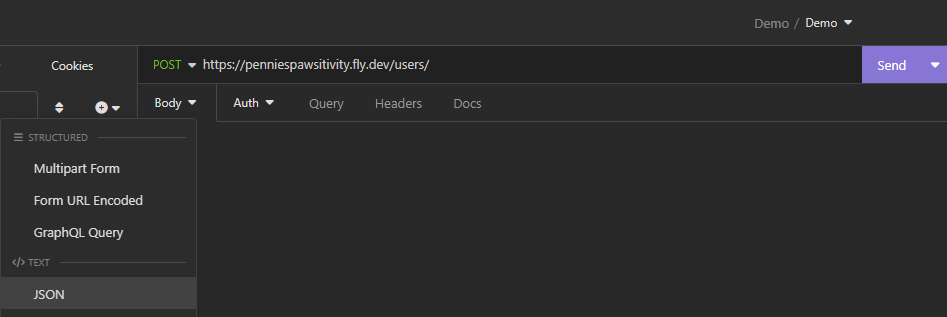
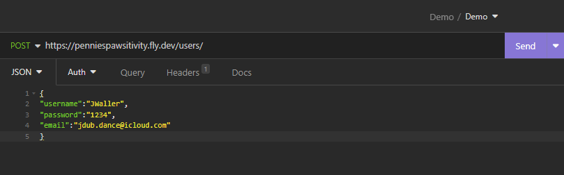
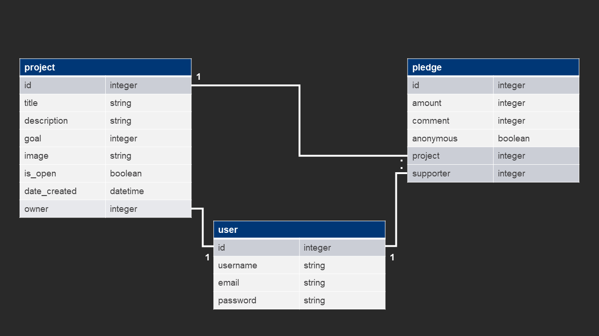

# Pennies for Pawsitivity
This is a DRF "backend" project I did during the SheCodes course.  
## About
Welcome to "Pennies for Pawsitivity" – the ultimate crowdfunding platform dedicated to spreading love, hope, and care for our feline friends. Our mission is to empower not-for-profit organisations that are tirelessly working to rescue, rehabilitate, and rehome cats in need.  
## Project requirements (Part A)
- [X] Have a cool name, bonus points if it includes a pun and/or missing vowels.
- [X] Have a clear target audience.
- [X] Have user accounts. A user should have at least the following attributes:  
    - [X] Username  
    - [X] Email address  
    - [x] Password 
- [X] Ability to create a “project” to be crowdfunded which will include at least thefollowing attributes:
  - [X] Title
  - [X] Owner (a user)
  - [X] Description
  - [X] Image 
  - [X] Target amount to fundraise
  - [X] Whether it is currently open to accepting new supporters or not
  - [X] When the project was created
- [X] Ability to “pledge” to a project. A pledge should include at least the followingattribute
  - [X] An amount
  - [X] The project the pledge is for
  - [X] The supporter/user (i.e. who created the pledge)
  - [X] Whether the pledge is anonymous or not
  - [X] A comment to go along with the pledge
- [ ] Implement suitable update/delete functionality, e.g. should a project owner beallowed to update a project description?
- [ ] Implement suitable permissions, e.g. who is allowed to delete a pledge?
- [X] Return the relevant status codes for both successful and unsuccessful requeststo the API.
- [X] Use Token Authentication.
## Submission requirements
- [X] A link to the deployed project: [Pennies for Pawsitivity](https://penniespawsitivity.fly.dev/projects/)
### Screenshots
- [X] A screenshot of Insomnia, demonstrating a successful GET method for any endpoint.  
 This GET method returns all projects.  
 
 
 
- [X] A screenshot of Insomnia, demonstrating a successful POST method for any endpoint.  
 This POST method shows a the successful creation a new project. 
 
 
 
- [X] A screenshot of Insomnia, demonstrating a token being returned. 
 This shows a token successfully being returned for the user "admin".  
 

### Instructions
- [X] Step by step instructions for how to register a new user and create a newproject (i.e. endpoints and body data).
#### How to register a new user
1. From your Insomnia dashboard, create a HTTP Request in the dropdown menu. 
  
 2. Rename the request to something like "Pennies Pawsitivity: Create a new user". 
  
 3. Select the GET method from the dropdown. 
  
 4. Enter "https://penniespawsitivity.fly.dev/users/" in the request URL output. 
  
 5. Select JSON as the </>TEXT. 
  
 6. Input data for the new user. For example: 
 { 
    "username":"JWaller", 
    "password":"1234", 
    "email":"jdub.dance@icloud.com" 
} 
  
 7. Send the request. The expected output should be a "200 OK" success message, and a preview of the new user's details. This screenshot shows each of these steps successfully executed in Insomnia. 
 
 
#### How to create a new project
1. From your Insomnia dashboard, create a HTTP Request in the dropdown menu. 
  

### Structure
- [X] Your refined API specification and Database Schema.
#### API Specification 
| HTTP Method | Url | Purpose | Request Body | Successful Response Code | Authentication   Authorization
| :--- | :--- | :--- | :--- | :--- | :--- |
| GET | /projects | Return all projects | N/A | 200 | N/A |
| POST | /projects | Create a new project | project object | 201 | User must be logged in. 
| GET | /projects/1/ | Returns the project with and ID of "1" | n/A | 200 | N/A
| POST | /pledges | Create a new pledge | Project object | 201 | Must be logged in Must not be the owner of the project
| GET | /pledges/1 | Returns a pledge with and ID of "1" | N/A | 200 | Must be logged in Must be the pledge owner
| DELETE | pledges/1 | Deletes the pledge with and ID of "1" | N/A | 200 | Must be logged in Must be the pledge owner
#### Database Schema
